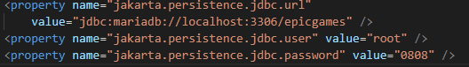
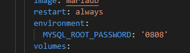

# db-jpa-assi-0803

Database project assigment 8-03. Connection with mariadb using jdbc and jpa

## Description

This application consist in a java main application that connects to a mariaDB server which allows us to interact with our database. It has two different parts: one connection with JDBC and other using JPA.

You can add more code in the main application using the APIs we created to intereact with your database.

## Before executing APP

To use this application, we recommend you to create a directory and clone this repository to it. Then just follow the following steps.

!IMPORTANT: remember that you have to change the mariaDB configuration in case you have one different as ours. You have to change it at [docker-compose](./docker-compose.yml)

And at the [persistence.xml](./assibdjpamariadb/src/main/resources/META-INF/persistence.xml).

Now that all is correctly running:

1. Create a docker container of mariaDB using: "docker compose up -d" at the root directory of the application.
2. Before executing app is necesary to execute both scripts: DDL and DML to create the database schema and the initial data.  
2.1 To execute the scripts, copy the content of both and run this command to run into the container of mariaDB: "docker exec -it db-jpa-assi-0803-db-1 mariadb -u root -p" and complete it with you passowrd.  
2.2 Then just paste both Scripts content to create the database.

3. When the database is running at the container and the schema is created. You can run the [app](./assibdjpamariadb/src/main/java/edu/craptocraft/assibdjpamariadb/App.java)

Confirm that the mariaDB instance is running at the correct location and that the database schema is correclty created. In case something did not work, just try to repeat the previous steps.

## Tutorials

To complete this task, we followed this tutorials:  [jdbc](https://mariadb.com/resources/blog/how-to-connect-java-applications-to-mariadb-using-jdbc/),[jdbc1](https://dzone.com/articles/jdbc-tutorial-part-1-connecting-to-a-database),[jdbc2](https://dzone.com/articles/jdbc-tutorial-part-2-running-sql-queries),[jdbc3](https://dzone.com/articles/jdbc-tutorial-part-3-using-database-connection-poo),[jpa](https://dzone.com/articles/getting-started-with-jpahibernate)

