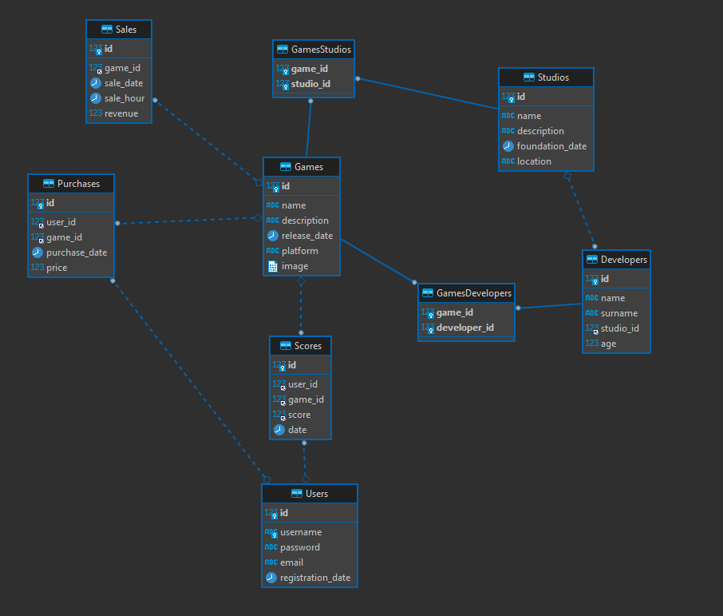

# db-jpa-assi-0803
Database project assigment 8-03. Connection with mariadb using jdbc and jpa

tutorials :  
    [jdbc](https://mariadb.com/resources/blog/how-to-connect-java-applications-to-mariadb-using-jdbc/)  
    [jdbc1](https://dzone.com/articles/jdbc-tutorial-part-1-connecting-to-a-database)  
    [jdbc2](https://dzone.com/articles/jdbc-tutorial-part-2-running-sql-queries)  
    [jdbc3](https://dzone.com/articles/jdbc-tutorial-part-3-using-database-connection-poo)  
    [jpa](https://dzone.com/articles/getting-started-with-jpahibernate)

